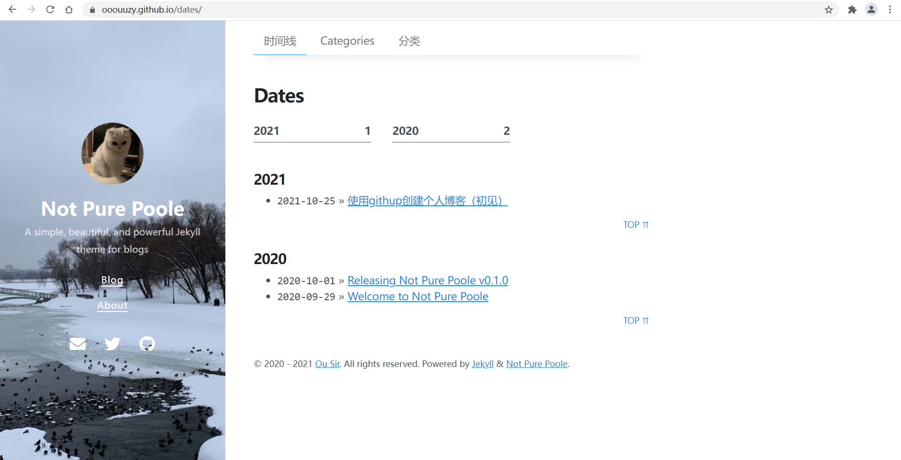
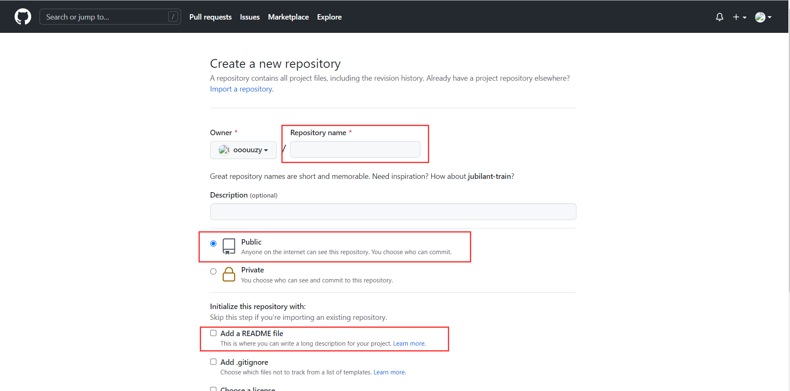
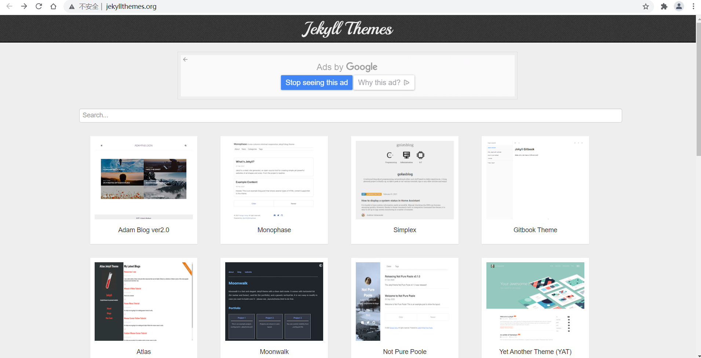
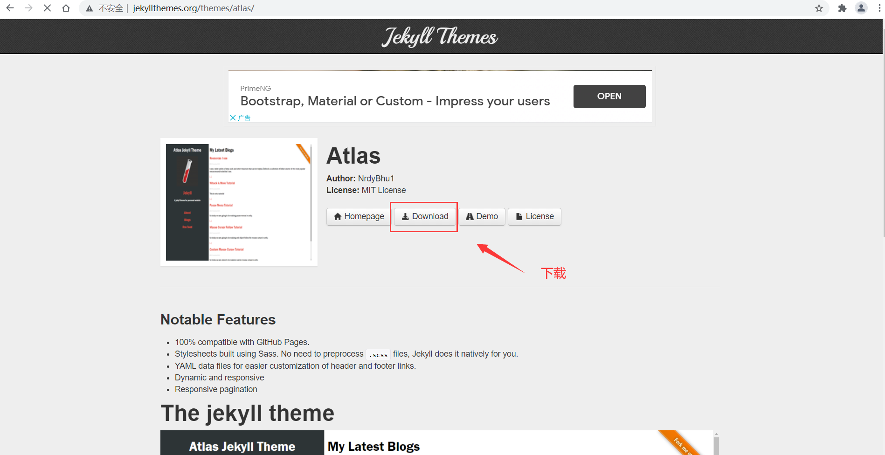
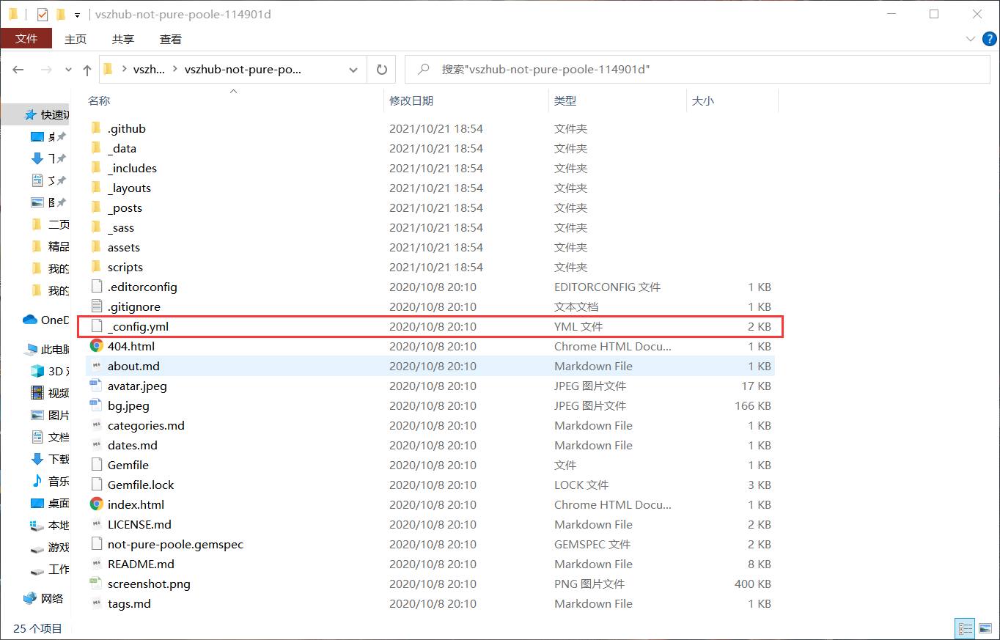
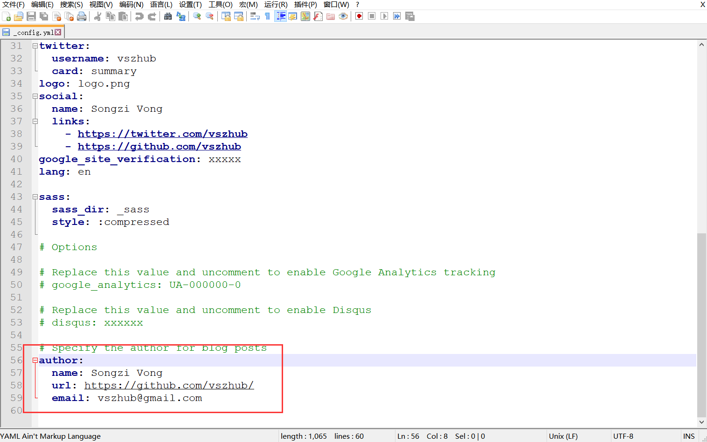
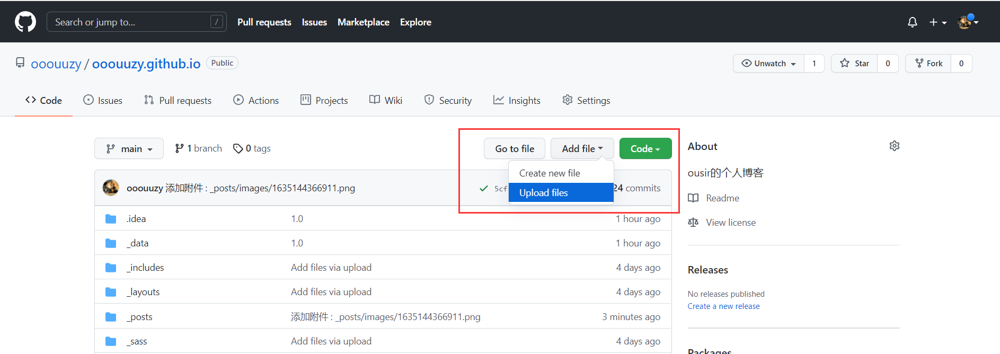
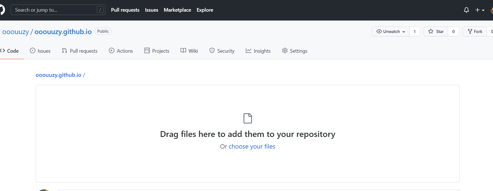
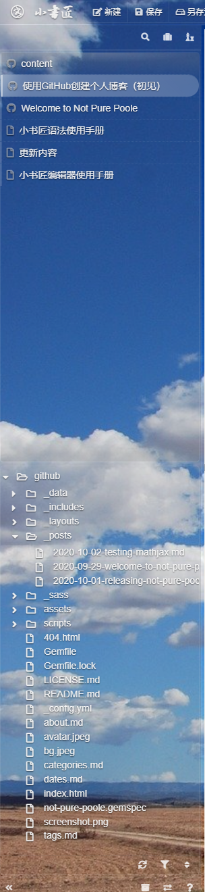

### 我们能够使用GitHub快速搭建我们的个人博客，像这样👇

#### 1、进入我们的Github仓库创建界面（这里默认你已经创建了Github账号）

###### （1）这里的Repository name仓库名称，为你的GitHub用户名加上github.io后缀，格式为 用户名+github.io，例如 ooouuzy.github.io
###### （2）仓库必须为公开的public
###### （3）添加一个README文件，主要是你的博客的描述  
#### 2、挑选主题
主题这里，我们使用此方法创建博客，只能使用jekyll主题的博客。
##### 在这里面可以选择自己喜欢的博客 [http://jekyllthemes.org/](http://jekyllthemes.org/)  

##### 选择自己喜欢的主题，下载 [http://jekyllthemes.org/themes/atlas/](http://jekyllthemes.org/themes/atlas/)

#### 3、修改主题配置，这里可以对主题进行定制，需要掌握html基本语法
##### 将下载好的压缩包进行解压，并修改_config.yml配置文件
](./images/1635144990534.png)
##### 修改这里的作者信息，url指向自己的GitHub仓库地址

#### 4、 将文件上传至GitHub仓库
##### 点击Add File => Upload Files

##### 将整个主题文件拖进去即可，记得提交！

#### 5、上面的步骤完成，这里输入 用户名.github.io 就可以访问了！
#### 6、更新博客
##### 由于我们写的文章都是放在 _posts文件夹下的，并且需要使用markdown编辑器进行编辑。这里为了方便大家，推荐一款markdown在线编辑器。
[小书匠markdown在线编辑器](http://markdown.xiaoshujiang.com/)
##### （1）使用首先，我们需要绑定我们的GitHub账号以及仓库地址，点击坐上角图片，选择绑定

##### （2）绑定成功的话，会出现可以GitHub文件夹

##### （3）文章修改与发表，在这里面将修改好的文件点击左上角保存，就可以自动发表啦

参考链接 https://www.cnblogs.com/wxyww/p/xiaoshujiang.html